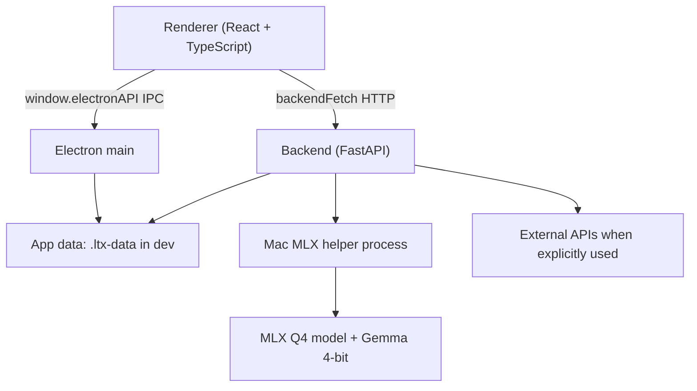

# LTX Desktop Mac Local Fork (no api needed)

This fork of [Lightricks/LTX-Desktop](https://github.com/Lightricks/LTX-Desktop)
adds a first working Apple Silicon local-generation path using MLX and the
compact Q4 LTX 2.3 model. It is intended to run locally on a Mac with about
36 GB of unified memory while keeping the original LTX API mode available.

> Status: working first milestone. Text-to-video runs locally through the MLX Q4
> path, with 720p 10-second generation confirmed working on the 36 GB target Mac.
> Local image-to-video uses a deterministic still-motion fallback because the
> current MLX Q4 distilled I2V path collapses into tiled artifacts after the
> first frame. The LTX API path remains available for true generative I2V.


## What This Fork Adds

- Local Apple Silicon generation mode: `mac_mlx_q4`.
- Project-local development storage in `.ltx-data/` so model/runtime downloads
  can stay on the external project drive.
- MLX Q4 model support from `dgrauet/ltx-2.3-mlx-q4`.
- MLX 4-bit Gemma text encoder and local prompt enhancement from
  `mlx-community/gemma-3-12b-it-4bit`.
- Prompt Enhancer visibility without requiring an LTX API key.
- A Gen Space scene queue for loading many video prompts and rendering them sequentially overnight.
- A Mac MLX speed control in Settings:
  - `Quality`: exact/default sampler.
  - `Boost`: skips stable middle denoise steps for faster text-to-video renders.
  - `Turbo`: more aggressive, text-to-video only, may add artifacts.
- A setup script: `scripts/setup-mac-mlx.sh`.

## Supported Local Mac Envelope

Validated target machine: Apple Silicon Mac with 36 GB unified memory.

| Resolution | Local MLX Q4 durations exposed in UI | Current recommendation |
| --- | --- | --- |
| 540p | 5-20 seconds at 24 fps | Good for longer tests |
| 720p | 5-20 seconds at 24 fps | Best default; 10-second clips are confirmed usable on the target Mac |
| 1080p | 5 seconds at 24 fps | 10 seconds can complete, but extended quality still needs more validation |

The app may be able to render beyond these limits if edited manually, but this
fork treats actual viewable quality as the release gate.

## Quick Start On Apple Silicon

Prerequisites:

- macOS on Apple Silicon (`arm64`)
- Git
- Node.js and Corepack
- `pnpm`
- `uv`
- Plenty of free space on the project drive. The local data folder can exceed
  50 GB once the MLX runtime, models, caches, and outputs are present.

From the project root:

```bash
corepack enable
pnpm install
scripts/setup-mac-mlx.sh
LTX_APP_DATA_DIR="$PWD/.ltx-data" LTX_MLX_PATH="$PWD/.ltx-data/ltx-2-mlx" pnpm dev
```

The setup script keeps its downloads under `.ltx-data/` by default:

```text
.ltx-data/
  ltx-2-mlx/              # MLX runtime checkout and Python 3.11 env
  models/
    ltx-2.3-mlx-q4/
    gemma-3-12b-it-4bit/
  uv-cache/
  hf-home/
  cache/
  outputs/
```

For more detail, see [docs/MAC_LOCAL_MLX.md](docs/MAC_LOCAL_MLX.md).

## Running The App

Development:

```bash
LTX_APP_DATA_DIR="$PWD/.ltx-data" LTX_MLX_PATH="$PWD/.ltx-data/ltx-2-mlx" pnpm dev
```

If `pnpm dev` tries to rerun dependency installation and asks to purge
`node_modules` in a non-interactive shell, launch the already-installed Vite
dev app directly instead:

```bash
LTX_APP_DATA_DIR="$PWD/.ltx-data" LTX_MLX_PATH="$PWD/.ltx-data/ltx-2-mlx" ./node_modules/.bin/vite
```

TypeScript check:

```bash
pnpm typecheck:ts
```

Focused backend tests used for this fork:

```bash
cd backend
UV_CACHE_DIR=../.ltx-data/uv-cache ../.venv-tools/bin/uv run --extra test python -m pytest \
  tests/test_settings.py \
  tests/test_generation.py::TestEnhancePromptFlag \
  tests/test_model_download_specs.py \
  tests/test_runtime_policy_decision.py \
  tests/test_models.py \
  -q
```

Full upstream checks remain:

```bash
pnpm typecheck
pnpm backend:test
pnpm build:frontend
```

## Scene Queue

In Gen Space video mode, open `Scene Queue` above the prompt bar. Paste one
prompt per line, click `Add`, then click the play button to render the queued
scenes one at a time. Pause stops after the current render finishes. Completed
clips are saved into the active project gallery just like normal generations.

Each queued scene snapshots the current reference images, input image, input
audio, and other generation settings at the moment it is added. The queue panel
exposes a queue-wide resolution selector and a per-scene time selector, so you can
load many prompts, set the global output size, then tune each scene duration
before pressing play. The queue is stored per project in local browser storage;
if the app reloads, any item that was mid-render is returned to `queued`. Use
`Clear all` to remove every row at once; the app asks for confirmation first, and
an already-started render will continue running.

## Data Locations

In development, this fork defaults Electron `userData` to:

```text
<repo>/.ltx-data
```

You can override it:

```bash
export LTX_APP_DATA_DIR="/Volumes/X10Pro4T/projects/ltx-mac/.ltx-data"
```

Packaged app defaults are still OS-standard unless `LTX_APP_DATA_DIR` is set:

- macOS: `~/Library/Application Support/LTXDesktop/`
- Windows: `%LOCALAPPDATA%\LTXDesktop\`
- Linux: `$XDG_DATA_HOME/LTXDesktop/` or `~/.local/share/LTXDesktop/`

## API Keys

Local Mac generation does not require the LTX video-generation API.

An LTX API key can still be useful for:

- API video generation.
- API-backed cloud text encoding on supported flows.
- API-backed prompt enhancement where configured.
- Retake/API features.

The local Mac MLX flow can use the downloaded Gemma helper for prompt
enhancement without an LTX API key.

Optional keys:

- fal API key: Z Image Turbo text-to-image generation in API mode.
- Gemini API key: AI prompt suggestions.

## Architecture

LTX Desktop has three main layers:

- `frontend/`: React 18 + TypeScript + Tailwind renderer.
- `electron/`: Electron main/preload process, app lifecycle, IPC, Python backend
  process management, and ffmpeg export.
- `backend/`: Python FastAPI server for ML orchestration, model downloads, API
  clients, and local generation services.



Key fork files:

- `backend/runtime_config/runtime_policy.py`: selects `mac_mlx_q4` on Apple
  Silicon with enough memory.
- `backend/runtime_config/model_download_specs.py`: source of truth for exposed
  local model/resolution/duration options.
- `backend/services/fast_video_pipeline/mlx_fast_video_pipeline.py`: backend
  wrapper around the MLX helper process.
- `backend/services/fast_video_pipeline/mlx_warm_helper.py`: long-lived MLX
  helper used for prompt enhancement, text encoding, and rendering.
- `scripts/setup-mac-mlx.sh`: project-local MLX runtime/model setup.
- `frontend/components/SettingsModal.tsx`: prompt enhancer and Mac MLX speed UI.
- `electron/app-paths.ts`: development `.ltx-data` user-data location.

## Documentation

- [Mac Local MLX Runbook](docs/MAC_LOCAL_MLX.md)
- [Installer Build Guide](docs/INSTALLER.md)
- [Telemetry](docs/TELEMETRY.md)
- [Contributing](docs/CONTRIBUTING.md)
- [Backend Architecture](backend/architecture.md)

## Known Limitations

- 1080p 10-second local Mac renders can complete, but the current usable output
  quality is only trusted for 5 seconds.
- `Boost` and `Turbo` are text-to-video performance/quality tradeoffs.
- Local Mac image-to-video uses a deterministic still-motion fallback. It avoids
  the MLX Q4 distilled I2V tiled-artifact failure, but it is not true generative
  motion. Use the LTX API path for generative image-to-video.
- The MLX path relies on a project-local `ltx-2-mlx` checkout at version
  `v0.14.0` prepared by `scripts/setup-mac-mlx.sh`; run with
  `LTX_MLX_PATH="$PWD/.ltx-data/ltx-2-mlx"` when starting from a shell.
- The local setup downloads large model/runtime assets that are intentionally
  ignored by Git.

## License

Application code is Apache-2.0; see [LICENSE.txt](LICENSE.txt).

Third-party notices and model terms may apply; see [NOTICES.md](NOTICES.md) and
the model repositories downloaded during setup.
